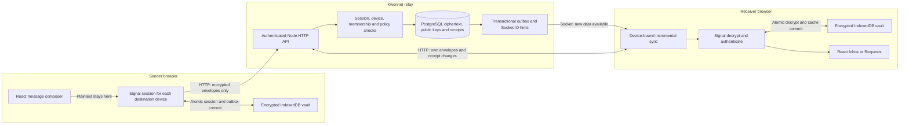
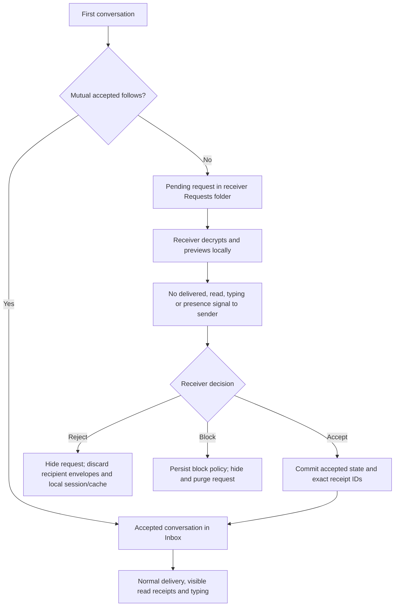
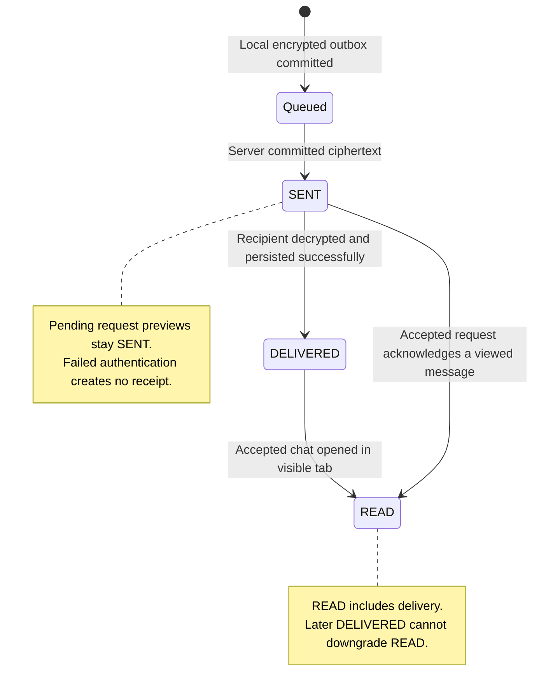
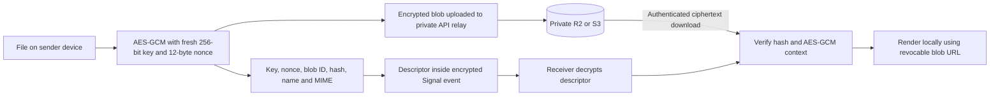
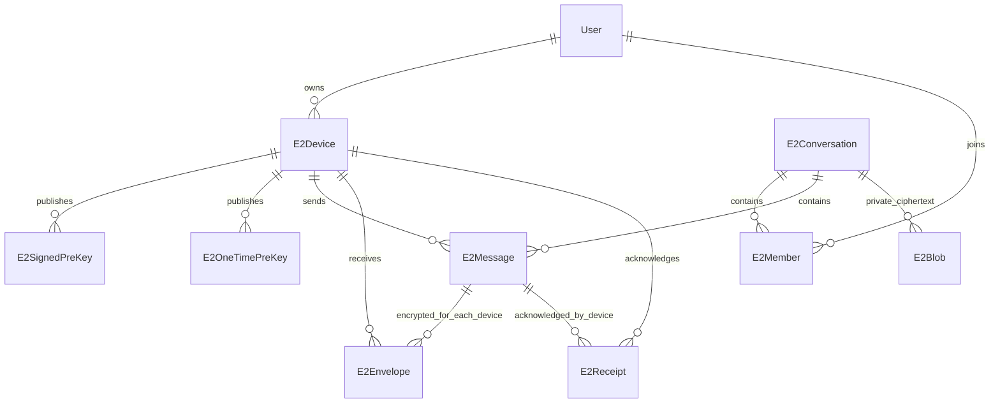

# How Kwonnet encrypted messaging works

This describes the implemented service in `kwonserver/src/services/v1/conversations`, its existing HTTP controllers/routes and Socket.IO namespace, and the web client under `kwonweb/src/lib/signal`, `src/lib/conversations` and the messages UI. PostgreSQL stores messaging metadata and ciphertext envelopes. Private R2/S3 stores encrypted file bytes, and Redis carries live socket hints. See [deployment notes](e2ee-messaging-deployment.md) for release steps and limits.

## 1. Overall architecture



The browser encrypts the message before sending it. The server checks who is sending, which device they enrolled, whether they belong to the conversation, and whether request/block rules permit delivery. PostgreSQL stores an encrypted envelope for each destination device. The receiver downloads only envelopes addressed to their own enrolled device and decrypts them locally.

The Socket.IO hint does not contain message text. Committed relay-outbox batches publish hints through Redis to all API instances. Device-bound socket sync is primary; reconnect catch-up and a slower adaptive fallback recover lost hints. Typing travels as an ephemeral socket event rather than a durable message.

The server can see routing IDs, timing, sizes and receipt metadata. It cannot read message text, encrypted actions or attachment secrets. First-use identity trust is not anonymity or key transparency; contacts can compare device fingerprints through a trusted channel.

## 2. Device setup and the first encrypted send

```mermaid
sequenceDiagram
  actor Alice
  participant AB as Alice browser
  participant AV as Alice IndexedDB
  participant API as Node API
  participant DB as PostgreSQL
  participant BB as Bob browser
  Alice->>AB: Set up or unlock messaging passphrase
  AB->>AB: Argon2id derives wrapping key in worker
  AB->>AV: Unwrap vault key; store private Signal keys locally
  AB->>API: Authenticated enrollment with public keys only
  API->>DB: Store immutable device identity and public prekeys
  AB->>API: Socket bind with signed device challenge
  API->>API: Verify proof of private signing key
  Note over BB,DB: Bob has independently enrolled his browser
  AB->>API: Discover recipient and other-own-account devices
  AB->>API: Claim public prekey bundle when session is absent
  API->>DB: Lock and claim one-time prekey; record claim ID
  DB-->>API: Claimed public bundle
  API-->>AB: Public identity, signed prekey, optional one-time prekey
  AB->>AB: Verify identity/signature; establish Signal session
  Alice->>AB: Send message
  AB->>AV: Commit advanced ratchet and exact ciphertext outbox together
  AB->>API: Send logical event ID and per-device ciphertext
  API->>DB: Commit message, envelopes and live-hint outbox
  API-->>AB: SENT acknowledgement and server sequence
  API-->>BB: Socket hint: data available
  BB->>API: Device-bound sync after saved cursor
  API-->>BB: Bob's encrypted envelope
  BB->>BB: Authenticate sender enrollment and decrypt with Signal
  BB->>BB: Validate encrypted event IDs, action signatures and context
  BB->>BB: Commit ratchet and decrypted cache to encrypted local vault
```

Each browser is a separate device. The vault key is random; the messaging passphrase wraps it using Argon2id and AES-GCM. Private identity keys, ratchet sessions, pending ciphertext and decrypted history are encrypted in IndexedDB. The passphrase is never persisted. The unlocked runtime stays in memory across app navigation for the signed-in session. An explicit **Remember this private browser for 30 days** option retains the non-extractable vault CryptoKey in account/device-scoped IndexedDB, enabling automatic unlock after sign-in; expiry, account change, sign-out, explicit Lock and device reset remove that remembered key. This option is appropriate only for private browser profiles: someone with access to that profile can access local messages. Without opting in, a full reload requires the passphrase.

New sessions use the installed Signal library's classical prekey exchange and Double Ratchet. A one-time public prekey is atomically claimed once. If none remain, the library uses the signed-prekey fallback. Public prekeys replenish and signed prekeys rotate on unlock; old private signed prekeys are retained for delayed messages for up to 90 days. Successfully consumed private one-time prekeys are removed as part of the decrypt commit.

Existing sessions skip new bundle claims. The sender encrypts to every active peer device and to their other enrolled devices. New devices receive future messages automatically. Older locally loaded history can be exported and restored through Messaging devices → Transfer older messages; device keys and live ratchet sessions never transfer. An account password reset cannot recover a forgotten messaging passphrase.

## 3. Message requests and silent previews



A pending receiver can preview messages without changing the sender's `SENT` status. Both the client and the server suppress receipts and typing while the request is pending. This is not merely a hidden UI indicator.

Accept is restricted to the intended receiver. It updates the conversation, acknowledges messages their device actually processed, and sends READ only for messages they viewed in the focused chat. Those exact IDs become retroactive receipts, and the thread moves to Inbox. Subsequent receipts work normally.

Reject privately hides the receiver's thread, discards their pending envelopes/blobs and clears the local conversation session/cache. Block also writes the application's existing `BlockUser` policy. The sender is not sent a rejected/read status. Later sends are discarded by relay policy. Device discovery and network timing are not a guarantee of indistinguishable rejection.

## 4. What SENT, DELIVERED and READ mean



Queued is a local state before server acknowledgement. The browser retries the same ciphertext and event ID. The server's idempotency check returns the original result for the same bytes and rejects different bytes under an existing ID. Uncommitted roster changes preserve existing ciphertext and add encryption only for new devices.

DELIVERED requires successful decrypt, validation and local storage commit. READ additionally requires an unlocked, accepted conversation open in a visible browser tab. Opening that conversation acknowledges authenticated received history through the latest cached message; pending-request previews remain silent. Background inbox catch-up acknowledges only delivery, never read. Receipts are stored durably and replayed through a separate incremental cursor. Invalid ciphertext or changed identities produce an authentication-failure placeholder without advancing the ratchet or acknowledging that message; valid later messages can continue.

## 5. Attachments and message actions



File bytes are encrypted before upload. The server stores blob ciphertext; the key, nonce, filename and MIME remain inside the encrypted message. Encryption authenticates the conversation and blob IDs, so moving a file to another context fails. Files are opened explicitly. Existing attachments remain readable; new videos, audio, documents and SVG uploads are disabled. The client checks image signatures before encryption; the relay checks ciphertext length (500 KiB plus the 16-byte AES-GCM tag) without seeing the MIME or plaintext. This implementation uses short-lived authenticated grants to private R2/S3: 500 KiB per new image (PNG, JPEG or WebP only), ten attachments per event and 100 uploads per device per day.

All content-bearing actions use the same encrypted channel:

| Action | What the recipient applies |
|---|---|
| Reply | Original event ID and hash reference |
| Reaction | Emoji add/remove bound to the original event ID/hash |
| Edit | Original author only, matching hash and next revision |
| Delete for everyone | Ed25519-signed deletion with author/device/thread/event/target binding; display a tombstone |
| Delete for me | Authenticated relay exclusion and local hiding for that user |

Deletion cannot recall a copy someone already saved. A reaction, edit or delete is not a plaintext server mutation; the browser validates and projects the decrypted event log.

## 6. Where information lives



| Location | Contents |
|---|---|
| Browser memory | Unlocked vault key and currently displayed plaintext |
| Encrypted IndexedDB vault | Private keys, Signal sessions, pending outbox, history, attachment secrets and sync cursors |
| `E2Device`, signed/one-time prekeys | Public key directory, device/session binding, revocation and public key material |
| `E2Conversation`, `E2Member` | Request state, participants and private hiding policy |
| `E2Message`, `E2Envelope` | Logical event IDs, ordered sequence and opaque per-device ciphertext |
| `E2Receipt`, `E2Outbox` | Monotonic receipt records and transactional socket/catch-up events |
| `E2PreKeyClaim` | Idempotent prekey claim results |
| `E2Blob` | Object keys, ciphertext lengths/hashes and lifecycle metadata |
| Private R2/S3 | Encrypted attachment bytes |
| Existing `BlockUser` | Blocking policy shared with the rest of the app |

The daily worker removes expired relay records after 90 days. Local history remains until removed on that browser. Device revocation prevents further authenticated delivery to that identity; resetting local messaging revokes the old device before deleting its vault.

## 7. What was removed

The application no longer imports Mongoose, opens Mongo connections, maintains Mongo message/session/device models, or uses the old custom X3DH/ratchet implementation. Anonymous-chat routes/components, stale registration wrappers and prototype code have been removed. The retirement migration drops only the seven obsolete SQL messaging tables and old call-status enum; active `E2*` tables remain.

Historical Prisma migrations remain immutable so fresh deployments can replay migration history before applying the retirement migration. No external production Mongo database is deleted by this repository cleanup. Direct messaging and passphrase-encrypted portable history snapshots are supported; groups, anonymous identities, calls and automatic cloud/key backup require separate implementations. The implementation has automated validation but is not independently cryptographically audited.

The [scaling guide](messaging/scaling.md) contains storage configuration, counter/batching behavior, migration steps and measured local workload results.


## Restoring older messages on a new browser

1. On an existing browser, unlock messaging and open the chats whose history you want to transfer. Export includes authenticated history already stored locally, not unsent queues or failed decryptions.
2. Open **Messaging devices → Export history**, choose and confirm a separate transfer passphrase (12–1024 characters), and download the encrypted JSON file.
3. Transfer the file to the new browser. Sign into the same account and set up its own messaging device/passphrase.
4. Open **Messaging devices → Restore history**, select the file, and enter the transfer passphrase. Opening a restored chat projects text, replies, reactions, edits and signed deletion events from the restored event log.

```mermaid
sequenceDiagram
  participant Old as Existing unlocked browser
  participant File as Encrypted transfer file
  participant New as New unlocked browser
  participant Relay as PostgreSQL / relay
  Old->>Old: Snapshot authenticated events + hidden IDs
  Old->>File: Argon2id + AES-256-GCM seal
  Note over File: No private identities, ratchets, cursors or retry queues
  File->>New: Select file and provide transfer passphrase
  New->>New: Authenticate account, schema and deletion signatures
  New->>New: Atomic merge into its own encrypted IndexedDB vault
  New->>Relay: Normal receipts for restored IDs when accepted/viewed
  Relay->>Relay: Validate original recipient account; decrement once
```

The archive uses a fresh 16-byte salt, Argon2id (3 operations, 64 MiB), a fresh 12-byte AES-GCM nonce and account-bound authenticated data. Schema validation, account checks, signed deletion verification, immutable event conflict checks and a single atomic vault commit protect restoration. Existing records, sessions, cursors and newer receipts remain intact. Hidden IDs merge by union. Files are capped at 48 MiB, decrypted snapshots at 32 MiB and 50,000 events; oversized exports fail explicitly.

This is a portable snapshot, not automatic device synchronization or recovery from the server. Without a saved export or an unlocked device, older plaintext cannot be recovered. Keep the file and its passphrase separately. Snapshots reflect deletion/hiding state at export time; later changes require a fresh export or live catch-up. Attachment descriptors and keys are restored, but encrypted media blobs are not embedded: original private objects must remain available and authorized, and the 90-day relay/object retention policy still applies. The recipient account can acknowledge restored message IDs still present in the relay; pending-request preview remains silent, acceptance activates receipts, and counters remain account-wide. Expired relay messages can be displayed from local history but cannot acquire new server receipts.

### Inbox activity and loading

Conversation metadata includes the latest relay sequence and stored last-activity time; the activity migration backfills existing conversations. Lists sort by committed activity, not creation date or the last locally viewed message. The client returns list metadata first, catches up two conversations at a time, and projects previews from authenticated encrypted events. Cached chat history renders before outbox retries/network catch-up; loading indicators distinguish loading, decrypting and syncing. Read-only vault projections no longer rewrite the encrypted snapshot. Deploy the new migration before the server and client.
