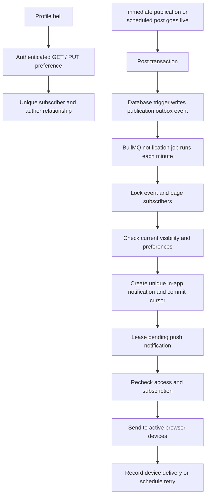

# Author post notifications

Users opt into an author's new-post notifications using the bell on their profile.
This is an account preference, separate from following an account and from a
browser's Web Push subscription. Turning off one author's bell leaves other
authors and the user's browser subscription enabled.

## Publication and delivery

The PostgreSQL publication trigger and post mutation commit atomically. If a
publication transaction rolls back, its event rolls back. A Redis outage cannot
lose the publication event; the next successful worker run reads it from the
database. There is no historical-post backfill.

One event is created per new root post or quote, including a draft transitioning
to published and a scheduled post transitioning to published. Editing, restoring,
reposting, replies and thread continuations do not create another announcement.
Quotes also require access to their parent post. Scheduled posts do not notify
subscribers while they are still scheduled.

`deliver_push_notifications` is the existing BullMQ recurring job. It first
processes up to ten subscriber batches, each with at most 100 relationships.
Events use `FOR UPDATE SKIP LOCKED`; each transaction writes notifications and
advances its cursor together. It cannot advance past recipients whose inserts
rolled back. `Notification.sourceKey` uniquely identifies a post and recipient,
so repeated/concurrent fanout cannot create duplicate notifications.

Subscribers must have opted in by the event's creation time and still be opted
in when their batch runs. New subscribers do not receive old announcements.
Deleted or inactive recipients are excluded. Eligibility applies the existing
public/followers-only feed access rules: public posts are allowed; private and
followers-only posts require an accepted follower relationship. Other restricted
scopes are conservatively excluded, as in the current feed rules. Hidden,
deleted, reported, blocked, muted or otherwise inaccessible posts never generate
an eligible notification. The inbox and unread counters apply these same checks
when read, so queued notifications cannot reveal content after access changes.

The push worker rechecks visibility and author opt-in before sending. A later
unsubscribe/resubscribe cannot revive an older queued push. Each run selects at
most 100 pending notifications, with ten notifications processed concurrently.
Active browser endpoints are scoped to their account and unrevoked, unexpired
login session. Successful endpoint IDs are recorded to avoid resending to them
when a different device fails. Invalid endpoints returning HTTP 404/410 are
removed. Transient failures retry after the five-minute lease, for at most five
attempts. Records at five attempts remain available for operational inspection.

Delivery is **at least once**, not exactly once: if a process dies after a push
provider accepts a message but before its receipt commits, that device may see a
retry. The stable notification ID is used as the browser notification tag to
replace duplicate visible notifications where supported. Already dispatched
browser notifications cannot be withdrawn by a later unsubscribe.

Notifications use a generic announcement, without copying post content into an
external push provider. The browser notification opens the author's current
`/@username/feed/postId` route; the page still enforces authorization.

## API and UI

| Endpoint | Behavior |
| --- | --- |
| `GET /api/v1/notifications/authors/:authorId` | Returns `{subscribed: boolean}` for the authenticated viewer. |
| `PUT /api/v1/notifications/authors/:authorId` | Accepts `{enabled: boolean}` and returns the persisted state. |

Both require authentication and return `Cache-Control: private, no-store`.
The subscriber ID always comes from authentication, never the request body.
PUT sets a desired state rather than toggling server state, making repeated
requests idempotent. A unique database constraint also handles concurrent tabs.
Self-subscriptions and subscriptions to inaccessible/blocked/muted accounts are
rejected. An unsubscribe succeeds even when the account is no longer accessible.

The profile uses SWR with viewer, author and authentication token in its cache key.
It revalidates on focus and displays the enabled state only after persistence
succeeds. Browser notification permission is requested only from the explicit
enable click. If permission or push configuration is unavailable, the in-app
preference is still saved and the UI explains that browser push is unavailable.
No permission request happens merely by visiting a profile.

## Deployment and operations

Deploy `20261007180000_author_post_notifications` with the normal migration
release step, regenerate/build the server, and deploy the API, worker and web
app together. No new queue or environment variable is required. The worker must
run with `RUN_BACKGROUND_JOBS` enabled, PostgreSQL and Redis access, and the
existing VAPID configuration; the web app needs the matching public VAPID key
and HTTPS. Browser delivery requires the user's permission and an active device
subscription. Scheduled publication uses the existing scheduled-post worker.

Under normal load announcements are processed on the next minute tick. Large
subscriber lists or a delivery backlog can span several ticks. Inspect pending
`PostPublicationNotification` rows (`completedAt IS NULL`) and unsent
`Notification` rows (`pushSentAt IS NULL`), especially `pushAttempts >= 5`.
Worker failures include notification/subscription IDs and provider status without
logging endpoint encryption keys or full notification payloads.

Regression coverage includes authentication ownership, idempotent concurrent
subscriptions, transaction rollback, immediate/scheduled/draft publication,
subscriber pagination, late opt-in, unsubscribe, private access, blocks/mutes,
hidden/deleted posts, safe deep links and successful-device retry suppression.
